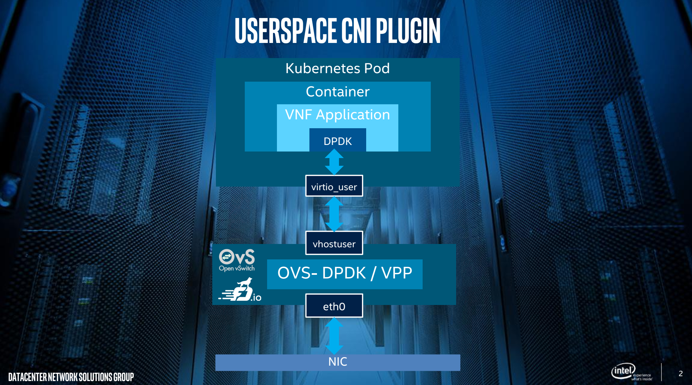
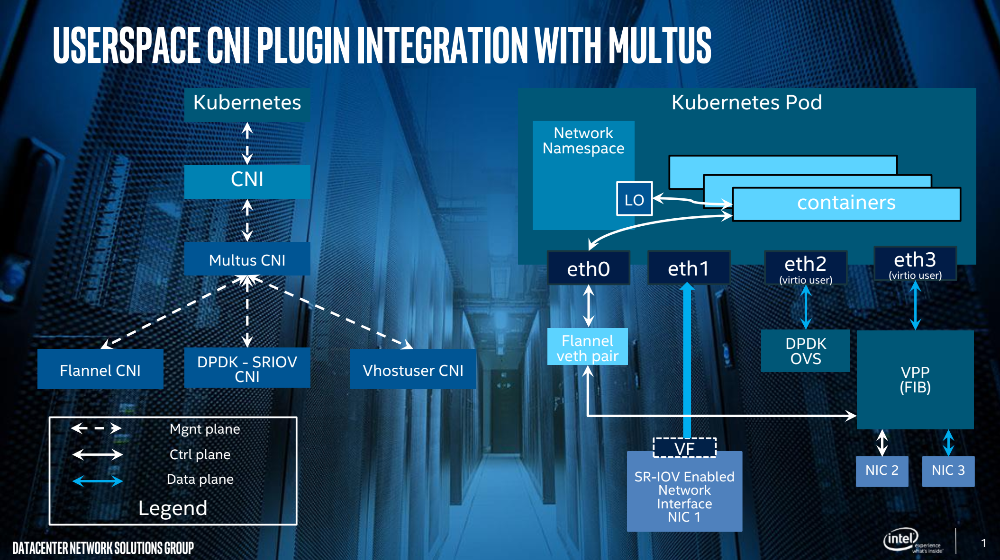

[](https://opensource.org/licenses/Apache-2.0)
[](https://securityscorecards.dev/viewer/?uri=github.com/intel/userspace-cni-network-plugin) 
 
[](https://goreportcard.com/report/github.com/intel/userspace-cni-network-plugin) 
[](https://pkg.go.dev/github.com/intel/userspace-cni-network-plugin) 
[](https://github.com/intel/userspace-cni-network-plugin/actions/workflows/e2e.yml)

   * [Links](#links)
   * [BiWeekly Meeting](#biweekly-meeting)
   * [Contacts](#contacts)
   * [Userspace CNI plugin](#userspace-cni-plugin)
   * [Build & Clean](#build--clean)
      * [Update dependencies](#update-dependencies)
   * [Network Configuration Reference](#network-configuration-reference)
      * [Work Standalone](#work-standalone)
      * [Integrated with Multus Plugin](#integrated-with-multus-plugin)
         * [Multus Configuration Details](#multus-configuration-details)
      * [Logging Options](#logging-options)
         * [Writing to a Log File](#writing-to-a-log-file)
         * [Logging Level](#logging-level)
   * [OVS CNI Library Intro](#ovs-cni-library-intro)
      * [Installing OVS](#installing-ovs)
      * [Running OVS CNI Library with OVS](#running-ovs-cni-library-with-ovs)
      * [Configuring the System](#configuring-the-system)
   * [VPP CNI Library Intro](#vpp-cni-library-intro)
      * [Building VPP CNI Library with OVS](#building-vpp-cni-library-with-ovs)
      * [Installing VPP](#installing-vpp)
         * [Prerequisites](#prerequisites)
         * [Install on CentOS](#install-on-centos)
         * [Install on Ubuntu](#install-on-ubuntu)
         * [Install on Other Distros](#install-on-other-distros)
   * [Testing](#testing)
      * [Testing with VPP Docker Image and CNI](#testing-with-vpp-docker-image-and-cni)
         * [Verify Host](#verify-host)
         * [Verify Container](#verify-container)
         * [Ping](#ping)
         * [Debug](#debug)
      * [Testing with DPDK Testpmd Application](#testing-with-dpdk-testpmd-application)
         * [1. Build the image to be used](#1-build-the-image-to-be-used)
         * [2. Create pod with multiple vhostuser interfaces](#2-create-pod-with-multiple-vhostuser-interfaces)
         * [3. Open terminal to pod and start testpmd](#3-open-terminal-to-pod-and-start-testpmd)
   * [Unit Testing](#unit-testing)
      * [Unit Tests Overview](#unit-tests-overview)
      * [Unit Tests Inside Container](#unit-tests-inside-container)

# Summary
The Userspace CNI is a Container Network Interface (CNI) plugin
designed to implement userspace networking (as opposed to kernel
space networking). An example is any DPDK based applications. It
is designed to run with either OVS-DPDK or VPP along with the Multus
CNI plugin in Kubernetes deployments. It enhances high performance
container Networking solution and Data Plane Acceleration for containers.

## Links
Useful Links:
* Source Code: https://github.com/intel/userspace-cni-network-plugin
* Design Document: [Userspace Design Document](https://docs.google.com/document/d/1jAFDNWhf6flTlPHmbWavlyLrkFJtAdQlcOnG3qhRYtU/edit?usp=sharing) 

## Biweekly Meeting
Join us for project discussions at _K8s Network & Resource management_ meetings

Time: 15:00 - 16:00 GMT / 10:00-11:00 ET /  07:00-08:00 PST  every other Monday
* [Meeting notes and agenda](https://docs.google.com/document/d/1sJQMHbxZdeYJPgAWK1aSt6yzZ4K_8es7woVIrwinVwI/edit?usp=sharing)
* [Zoom channel](https://zoom.us/j/2392609689?pwd=K1R4ZEQyWWJVSGV3V1pmVThLMlhqQT09)

## Contacts
For any questions about Userspace CNI, please reach out.
* Report issue via Github: [userspace-cni-network-plugin/issues](https://github.com/intel/userspace-cni-network-plugin/issues)
* Contact via slack: [NPWG Slack](https://npwg-team.slack.com/)
  * Feel free to contact the developer @garyloug or @bmcfall in slack
* Contact via Google Group: https://groups.google.com/forum/#!forum/userspace-cni

# Userspace CNI Plugin
The Userspace CNI is a Container Network Interface (CNI) plugin designed to
implement userspace networking (as opposed to kernel space networking), like
DPDK based applications. It is designed to run with either OVS-DPDK or VPP
running on the host, along with the
[Multus CNI plugin](https://github.com/intel/multus-cni), which enables additional
interfaces in a container.

Userspace networking requires additional considerations. For one, the interface
needs to be created/configured on a local vswitch (running on the host). There
may also be a desire to add the interface to a specific network on the host
through the local vswitch. Second, when the interface is inserted into the
container, it is not owned by the kernel, so additional work needs to be done
in the container to consume the interface and add to a network within the
container. The Userspace CNI is designed to work with these additional
considerations by provisioning the local vswitch (OVS-DPDK/VPP), and by pushing
data into the container so the interface can be consumed.

The Userspace CNI, based on the input config data, adds interfaces (memif and/or
vhost-user interfaces) to a local OVS-DPDK or VPP instance running on the host.
Then adds that interface to a local network, like an L2 Bridge. The Userspace CNI
then processes config data intended for the container and adds that data to a
Database the container can consume.

DPDK Vhostuser is new virtualization technology. Please refer to
[here](http://dpdk.org/doc/guides/howto/virtio_user_for_container_networking.html)
for more information.




# Build & Clean

This plugin is recommended to be built with Go 1.22.3 and either OVS-DPDK 2.9.0-3
or VPP 23.02. Other versions of Go, OVS-DPDK and VPP are theoretically
supported, but MIGHT cause unknown issue.

The Userspace CNI requires several files from VPP in-order to build.
For this reason we build userspacecni in a container.

userspacecni is built in a container and then transferred to the host.
By default Docker is used to build the image

Before building be sure to modify the makefile variable `IMAGE_REGISTRY`.
`IMAGE_REGISTRY` should be set to an image registry thats accessible across your cluster.

To build the docker image:
```
  git clone https://github.com/intel/userspace-cni-network-plugin.git
  cd userspace-cni-network-plugin
  make build
```

To copy the userspacecni binary to the host directory `/opt/cni/bin/`
```
  make copy
```
To push the image to the docker reg defined in the makefile
```
  make push
```
To deploy the userspacecni across the cluster
```
  make deploy
```

# Network Configuration Reference

* `type` (string, required): "userspace"
* `name` (string, required): Name of the network
* `host` (dictionary, required): Host based configurations. Contains userspace
interface configuration data as well as host network data userspace interface
should be injected into.
* `container` (dictionary, optional): Container based configurations. Contains
userspace interface configuration data as well as container network data
userspace interface should be injected into. Defaults used when data omitted.
* `ipam` (dictionary, optional): IPAM configuration to be used for this network.


## Work Standalone

Given the following network configuration:
```
sudo cat > /etc/cni/net.d/90-userspace.conf <<EOF
{
	"cniVersion": "0.3.1",
        "type": "userspace",
        "name": "memif-network",
        "host": {
                "engine": "vpp",
                "iftype": "memif",
                "netType": "bridge",
                "memif": {
                        "role": "master",
                        "mode": "ethernet"
                },
                "bridge": {
                        "bridgeName": "4"
                }
        },
        "container": {
                "engine": "vpp",
                "iftype": "memif",
                "netType": "interface",
                "memif": {
                        "role": "slave",
                        "mode": "ethernet"
                }
        },
	"ipam": {
		"type": "host-local",
		"subnet": "10.56.217.0/24",
		"rangeStart": "10.56.217.131",
		"rangeEnd": "10.56.217.190",
		"routes": [
			{
				"dst": "0.0.0.0/0"
			}
		],
		"gateway": "10.56.217.1"
	}
}
EOF
```


## Integrated with Multus Plugin
Integrate with the Multus plugin for a high performance container networking
solution for NFV Environments. Refer to Multus (NFV based Multi - Network
plugin), DPDK-SRIOV CNI plugins:
* [Multus - Multi Network plugin](https://github.com/Intel-Corp/multus-cni)
* [DPDK-SRIOV - Dataplane plugin](https://github.com/Intel-Corp/sriov-cni)

Encourage the users/developers to use Multus based Kubernetes CDR/TPR based
network objects. Please follow the configuration details in the link:
[Usage with Kubernetes CRD/TPR based Network Objects](https://github.com/Intel-Corp/multus-cni/blob/master/README.md#usage-with-kubernetes-crdtpr-based-network-objects)

Please refer the Kubernetes Network SIG - Multiple Network PoC proposal for more
details refer the link:
[K8s Multiple Network proposal](https://docs.google.com/document/d/1TW3P4c8auWwYy-w_5afIPDcGNLK3LZf0m14943eVfVg/edit)



### Multus Configuration Details
```
# cat > /etc/cni/net.d/10-multus.conf <<EOF
{
    "name": "multus-demo-network",
    "type": "multus",
    "delegates": [
        {
                "type": "sriov",
                "if0": "ens786f1",
		"if0name": "net0",
		"dpdk": {
			"kernel_driver": "ixgbevf",
			"dpdk_driver": "igb_uio",
			"dpdk_tool": "/path/to/dpdk/tools/dpdk-devbind.py"
		}
	},
	{
		"cniVersion": "0.3.1",
		"type": "userspace",
		"name": "memif-network",
		"host": {
			"engine": "vpp",
			"iftype": "memif",
			"netType": "bridge",
			"memif": {
				"role": "master",
				"mode": "ethernet"
			},
			"bridge": {
				"bridgeName": "4"
			}
		},
		"container": {
			"engine": "vpp",
			"iftype": "memif",
			"netType": "interface",
			"memif": {
				"role": "slave",
				"mode": "ethernet"
			}
		},
		"ipam": {
			"type": "host-local",
			"subnet": "10.56.217.0/24",
			"rangeStart": "10.56.217.131",
			"rangeEnd": "10.56.217.190",
			"routes": [
				{
					"dst": "0.0.0.0/0"
				}
			],
			"gateway": "10.56.217.1"
		}
        },
        {
                "type": "flannel",
    		"name": "control-network",
                "masterplugin": true,
                "delegate": {
                        "isDefaultGateway": true
    		}
        }
    ]
}
EOF
```

**Note:** The Userspace CNI supports different IPAM plugins for the IP addresses
management. The generated IP address information will be stored in one
configuration file.

## Logging Options
You may wish to enable some enhanced logging, especially to understand what is
or isn't working with a particular configuration. Userspace CNI always log via
`STDERR`, which is the standard method by which CNI plugins communicate errors,
and these errors are logged by the Kubelet. This method is always enabled.

### Writing to a Log File
Optionally, Userspace CNI can log to a file on the filesystem. This file will
be written locally on each node where CNI is executed. Configure this via the
`LogFile` option in the CNI configuration. By default this additional logging
to a flat file is disabled.

For example in your CNI configuration, you may set:
```
    "logFile": "/var/log/userspace-cni.log",
```

### Logging Level

The default logging level is set as `warning` -- this will log critical errors
and issues detect.

The available logging level values, in increasing order of verbosity are:

* `panic`
  * Code exiting immediately.
* `error`
  * Unusual event occurred (invalid input or system issue), so exiting code prematurely.
* `warning`
  * Unusual event occurred (invalid input or system issue), but continuing with default value.
* `info`
  * Basic information, indication of major code paths.
* `debug`
  * Additional information, indication of minor code branches.
* `verbose`
  * Output of larger variables in code and debug of low level functions.

You may configure the logging level by using the `LogLevel` option in your
CNI configuration. For example:

```
    "logLevel": "debug",
```


# OVS CNI Library Intro
OVS CNI Library is written in GO and used by UserSpace CNI to interface with the
OVS. OVS currently does not have a GO-API, though there are some external
packages that are being explored. When the CNI is invoked, OVS CNI library
builds up an OVS CLI command (ovs-vsctl) and executes the request.

## Installing OVS
To install the DPDK-OVS, the source codes contains a
[document](https://github.com/openvswitch/ovs/blob/master/Documentation/intro/install/dpdk.rst)
for how to install the DPDK-OVS.

## Running OVS CNI Library with OVS
The Userspace CNI plugin builds the OVS CNI Library from the cniovs
sub-folder. In order to run with the OVS CNI Library, the OVS python script
must be installed on the system. To install the script, run *make install*
as described in
[Building VPP CNI Library with OVS](#building-vpp-cni-library-with-ovs). 

## Configuring the System
DPDK-OVS is a DPDK based application, so some detailed system requirements can
be found at
[DPDK requirements](http://dpdk.org/doc/guides/linux_gsg/sys_reqs.html).
Hugepages are the main requirement for the VHOST_USER virtual ports.
```
echo 'vm.nr_hugepages=2048' > /etc/sysctl.d/hugepages.conf
```
Or add the following configuration to the grub configuration:
```
default_hugepagesz=2m hugepagesz=2m hugepages=2048
```


# VPP CNI Library Intro
VPP CNI Library is written in GO and used by UserSpace CNI to interface with the
VPP GO-API. When the CNI is invoked, VPP CNI library opens a GO Channel to the
local VPP instance and passes gRPC messages between the two.

As mentioned above, to build the Userspace CNI, VPP needs to be installed, or
several VPP files to compile against. When VPP is installed, it copies it's
json API files to */usr/share/vpp/api/*. VPP CNI Libary uses these files to
compile against and generate the properly versioned messages to the local VPP
Instance. So to build the VPP CNI, VPP must be installed (or the proper json
files must be in */usr/share/vpp/api/*).


## Installing VPP
There are several ways to install VPP. This code is based on a fixed release
VPP (VPP 23.02), so it is best to install a released version (even
though it is possible to build your own).


### Prerequisites
Below are the VPP prerequisites:
* **Hugepages:** VPP requires 2M Hugepages. By default, VPP uses 1024
hugepages. If hugepages are not configured, on install VPP will allocate
them. This is primarily an issue if you are running in a VM that does not
already have hugepage backing, especially when you reboot the VM. If you
would like to change the number of hugepages VPP uses, after installing VPP,
edit */etc/sysctl.d/80-vpp.conf*. However, once VPP has been installed, the
default value has been applied. As an example, to reduce the number of
hugepages to 512, use:
```
   vm.nr_hugepages=512  
   vm.max_map_count=2048  
   kernel.shmmax=1073741824
```  
* **SELinux:** VPP works with SELinux enabled, but when running with
containers, work still needs to be done. Set SELinux to permissive.

### VPP install guide
https://s3-docs.fd.io/vpp/23.02/gettingstarted/installing/

### VPP source code
https://github.com/FDio/vpp/tree/v23.02

### OVS install guide
https://docs.openvswitch.org/en/latest/intro/install/

### OVS source code
https://github.com/openvswitch/ovs/tree/master

# Testing

## Testing VPP with VPP pod as application
Its assumed that VPP has been set up on the host correctly by the user.
On the server that the vpp pods get deployed (not the k8 controller) create the directories `/var/run/vpp/app1`
and `/var/run/vpp/app2` for this example to work

```
kubectl create ns vpp

kubectl create -f ./examples/vpp-memif-ping/userspace-vpp-netAttach.yaml

kubectl create -n vpp configmap vpp-app-startup-config --from-file=./examples/vpp-memif-ping/startup.conf

kubectl create -n vpp configmap vpp-pod-setup-memif --from-file=./examples/vpp-memif-ping/vpp-pod-setup-memif.sh

kubectl create -f ./examples/vpp-memif-ping/vpp-app-pod-1.yaml
kubectl create -f ./examples/vpp-memif-ping/vpp-app-pod-2.yaml

kubectl exec -itn vpp vpp-app1 -- ./vpp-pod-setup-memif.sh
kubectl exec -itn vpp vpp-app2 -- ./vpp-pod-setup-memif.sh

# ping pod 2 from pod 1 (through vpp)
kubectl exec -itn vpp vpp-app1 -- vppctl "ping  192.168.1.4"
```

Sample output
```
116 bytes from 192.168.1.4: icmp_seq=1 ttl=64 time=83.4641 ms
116 bytes from 192.168.1.4: icmp_seq=2 ttl=64 time=72.0057 ms
116 bytes from 192.168.1.4: icmp_seq=3 ttl=64 time=67.9981 ms
116 bytes from 192.168.1.4: icmp_seq=4 ttl=64 time=75.9974 ms
116 bytes from 192.168.1.4: icmp_seq=5 ttl=64 time=72.0021 ms

```

### Optional debug steps for VPP
### Verify Host
To verify the local config (on host) in another window:

**Before Container Started:**
```
vppctl show interface
              Name               Idx       State          Counter          Count     
GigabitEthernet0/8/0              1        down      
GigabitEthernet0/9/0              2        down      
local0                            0        down      
   
vppctl show mode
l3 local0  
l3 GigabitEthernet0/8/0  
l3 GigabitEthernet0/9/0  
   
vppctl show memif
sockets
  id  listener    filename
  0   no          /run/vpp/memif.sock
```

After the container is started, on the host there should be an additional memif
interface created and added to a new L2 bridge, all created by the Userspace
CNI.


**After vpp pod application Started:**
```
vppctl show interface
              Name               Idx       State          Counter          Count
GigabitEthernet0/8/0              1        down
GigabitEthernet0/9/0              2        down
local0                            0        down
memif1/0                          3         up
   
vppctl show mode
l3 local0
l3 GigabitEthernet0/8/0
l3 GigabitEthernet0/9/0
l2 bridge memif1/0 bd_id 4 shg 0
   
vppctl show memif
sockets
  id  listener    filename
  0   no          /run/vpp/memif.sock
  1   yes (1)     /var/run/vpp/cni/shared/memif-79b661b189b2-net0.sock
   
interface memif1/0
  remote-name "VPP 18.07-16~gca7a68e~b66"
  remote-interface "memif1/0"
  socket-id 1 id 0 mode ethernet
  flags admin-up connected
  listener-fd 22 conn-fd 23
  num-s2m-rings 1 num-m2s-rings 1 buffer-size 0 num-regions 1
  region 0 size 4227328 fd 24
    master-to-slave ring 0:
      region 0 offset 16512 ring-size 1024 int-fd 26
      head 1024 tail 0 flags 0x0001 interrupts 0
    slave-to-master ring 0:
      region 0 offset 0 ring-size 1024 int-fd 25
      head 0 tail 0 flags 0x0001 interrupts 0
```

### Verify Container
The container is setup to start VPP, read the config pushed by the User Space
CNI, apply the data and then exit to bash. To verify the container config, in
the container, run the following:
```
vppctl show interface
              Name               Idx       State          Counter          Count     
local0                            0        down      
memif1/0                          1         up       
   
vppctl show interface addr
local0 (dn):
memif1/0 (up):
  L3 192.168.210.45/24
   
vppctl show mode          
l3 local0  
l3 memif1/0  
   
vppctl show memif
sockets
  id  listener    filename
  0   no          /run/vpp/memif.sock
  1   no          /var/run/vpp/cni/shared/memif-05138381d803-net0.sock
   
interface memif1/0
  remote-name "VPP 18.07-rc2~11-g18bde8a"
  remote-interface "memif1/0"
  socket-id 1 id 0 mode ethernet
  flags admin-up slave connected
  listener-fd 0 conn-fd 17
  num-s2m-rings 1 num-m2s-rings 1 buffer-size 2048 num-regions 1
  region 0 size 4227328 fd 18
    slave-to-master ring 0:
      region 0 offset 0 ring-size 1024 int-fd 19
      head 0 tail 0 flags 0x0001 interrupts 0
    master-to-slave ring 0:
      region 0 offset 16512 ring-size 1024 int-fd 20
      head 1024 tail 0 flags 0x0001 interrupts 0
```

### Ping
If a second container is started on the same host, the two containers will have
L3 connectivity through an L2 bridge on the host. Because the interfaces in the
host are owned by VPP, use VPP in one of the containers to ping between the two
containers.
```
vppctl ping 192.168.210.46   
64 bytes from 192.168.210.46: icmp_seq=2 ttl=64 time=39.0119 ms
64 bytes from 192.168.210.46: icmp_seq=3 ttl=64 time=37.9991 ms
64 bytes from 192.168.210.46: icmp_seq=4 ttl=64 time=57.0304 ms
64 bytes from 192.168.210.46: icmp_seq=5 ttl=64 time=40.0044 ms
   
Statistics: 5 sent, 4 received, 20% packet loss
```

## Testing with DPDK Testpmd Application


To follow this example you should have a system with kubernetes available and
configured to support native 1 GB hugepages. You should also have multus-cni and
userspace-cni-network-plugin up and running. See `examples/crd-userspace-net-ovs-no-ipam.yaml` for
example config to use with multus. If using OVS,
check that you have bridge named `br0` in your OVS with `ovs-vsctl show` and if
not, create it with
`ovs-vsctl add-br br0 -- set bridge br0 datapath_type=netdev`.

Build testpmd container image
```
make testpmd
```

Modify the nodeSelector `kubernetes.io/hostname:` in both `./examples/ovs-vhost/testpmd-pod-1.ymal` and `./examples/ovs-vhost/testpmd-pod-2.ymal` 

```
kubectl create ns ovs
kubectl apply -f ./examples/ovs-vhost/userspace-ovs-netAttach-1.yaml
kubectl apply -f ./examples/ovs-vhost/testpmd-pod-1.yaml
kubectl apply -f ./examples/ovs-vhost/testpmd-pod-2.yaml
```
At this point pod 1 should be sending traffic to pod 2.
By doing a kubectl logs on pod 2 you will be able to verify that the pod is receiving traffic by looking ath the RX value.

Sample output from a working environment
```
root@hostname:~/userspace-cni-network-plugin# kubectl logs -n ovs pod/ovs-app2 |tail -11
Port statistics ====================================
  ######################## NIC statistics for port 0  ########################
  RX-packets: 404024960  RX-missed: 0          RX-bytes:  25857597440
  RX-errors: 0
  RX-nombuf:  0
  TX-packets: 0          TX-errors: 0          TX-bytes:  0

  Throughput (since last show)
  Rx-pps:      1044345          Rx-bps:    534705080
  Tx-pps:            0          Tx-bps:            0
  ############################################################################

```

# Unit Testing

## Unit Tests Overview

The Userspace CNI networking plugin is written in [GO](https://golang.org/) and
it uses [GO Testing](https://golang.org/pkg/testing) package for unit testing.
In order to simplify unit test code, a [testify](https://github.com/stretchr/testify)
toolkit is also used for [assertions](https://godoc.org/github.com/stretchr/testify/assert).
Unit test files have suffix *_test.go* and they are located at the same directory
as the production code.

For example *userspace* package have one source file and one file with unit tests:

```bash
   userspace/userspace.go
   userspace/userspace_test.go
```

In the file `userspace_test.go` you can find a set of test functions with the same
name as functions from `userspace.go` with prefix `Test`. Each test function
implements a set of tests to test production code thoroughly with different
input data, etc.

Testing binary is built and tests executed by `go test` command at directory
with test files.

For example, unit tests for userspace package with verbose output can be executed
as follows:

```bash
cd userspace
go test -v
```

An example of verbose output of userspace unit tests:

```bash
=== RUN   TestPrintVersionString
=== RUN   TestPrintVersionString/verify_version_string
--- PASS: TestPrintVersionString (0.00s)
    --- PASS: TestPrintVersionString/verify_version_string (0.00s)
=== RUN   TestLoadNetConf
=== RUN   TestLoadNetConf/fail_to_parse_netConf_1
=== RUN   TestLoadNetConf/fail_to_parse_netConf_2
=== RUN   TestLoadNetConf/fail_to_parse_netConf_3
=== RUN   TestLoadNetConf/fail_to_parse_netConf_4
=== RUN   TestLoadNetConf/fail_to_parse_netConf_5
=== RUN   TestLoadNetConf/fail_to_parse_netConf_6
=== RUN   TestLoadNetConf/fail_to_set_default_logging_level
=== RUN   TestLoadNetConf/fail_to_set_log_file
=== RUN   TestLoadNetConf/load_correct_netConf
--- PASS: TestLoadNetConf (0.00s)
    --- PASS: TestLoadNetConf/fail_to_parse_netConf_1 (0.00s)
    --- PASS: TestLoadNetConf/fail_to_parse_netConf_2 (0.00s)
    --- PASS: TestLoadNetConf/fail_to_parse_netConf_3 (0.00s)
    --- PASS: TestLoadNetConf/fail_to_parse_netConf_4 (0.00s)
    --- PASS: TestLoadNetConf/fail_to_parse_netConf_5 (0.00s)
    --- PASS: TestLoadNetConf/fail_to_parse_netConf_6 (0.00s)
    --- PASS: TestLoadNetConf/fail_to_set_default_logging_level (0.00s)
    --- PASS: TestLoadNetConf/fail_to_set_log_file (0.00s)
    --- PASS: TestLoadNetConf/load_correct_netConf (0.00s)
...
```

It is possible to execute unit tests directly from the host where the code is
being developed. However it is strongly recommended to execute them from within
a container. It will assure that unit tests will be isolated from the host
and thus avoid any collision with the host environment (e.g. k8s or OVS).
Another advantage is a possibility to easily execute unit tests at various Linux
OS distributions. Support of unit test execution inside containers is implemented
by project Makefile and described in following paragraphs.

## Unit Tests Inside Container

Project `Makefile` defines a set of targets suitable for unit testing inside
containers. In order to build and use testing containers, both `docker` and
`gcc` (C preprocessor is used to assemble Dockerfiles) have to be installed
at the host.

Example of tools installation at Ubuntu:

```bash
   apt install docker.io gcc
```

After the installation is completed, then any of unit test specific targets
can be executed in order to:

* build test containers and update them in case that new commit is detected
* execute unit tests
* calculate code coverage
* cleanup unit test container images and generated docker files

Targets for container building, unit testing and code coverage calculation
are prepared in three different versions to be executed at:

* Linux OS distribution defined by `UT_OS` environment variable

  e.g. execute build of container image for CentOS8

  ```bash
     export UT_OS=centos8
     make test-build
  ```

* Linux OS distribution specified by target suffix

  e.g. calculate code coverage at Ubuntu 20.04

  ```bash
     make coverage-ubuntu20.04
  ```

* all supported OS distributions

  e.g. execute unit tests at all supported OS distros:

  ```bash
     make test-all
  ```

The list of supported `make` targets is also documented as part of `make help`
as follows:

```
Make Targets for unit testing inside containers:
 make test-clean      - Remove test container images and generated Dockerfiles.
 make test-build      - Build container image for unit tests with OS defined by UT_OS: UT_OS=ubuntu20.04
 make test            - Run unit tests inside container with OS defined by UT_OS: UT_OS=ubuntu20.04
 make coverage        - Calculate code coverage in container with OS defined by UT_OS: UT_OS=ubuntu20.04
 make test-build-<os> - Build container image for unit tests with <os>, e.g. make test-build-centos8
 make test-<os>       - Run unit tests inside container with <os>, e.g. make test-centos8
 make coverage-<os>   - Calculate code coverage inside container with <os>, e.g. make coverage-centos8
 make test-build-all  - Build container images for unit tests for all supported OS distributions
                        e.g. make -j 5 test-build-all
 make test-all        - Run unit tests inside container for all supported OS distributions
                        e.g. make -j 5 test-all
 make coverage-all    - Calculate code coverage inside container for all supported OS distributions.
                        e.g. make -j 5 coverage-all
```
