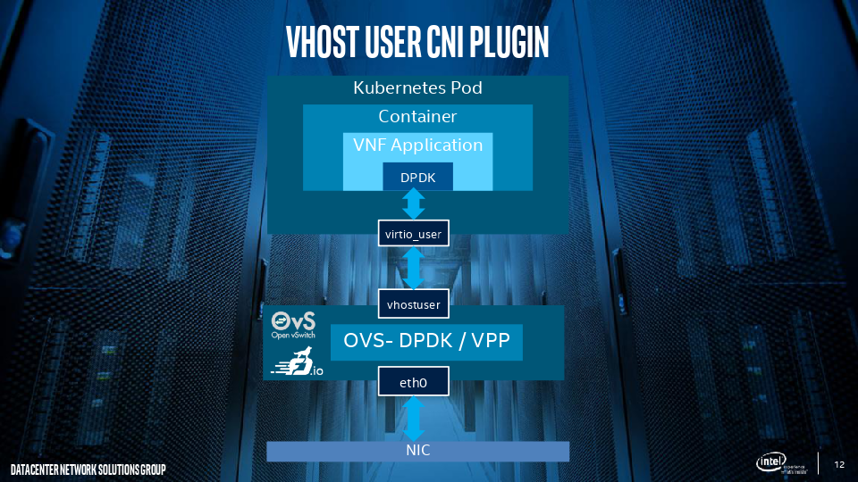
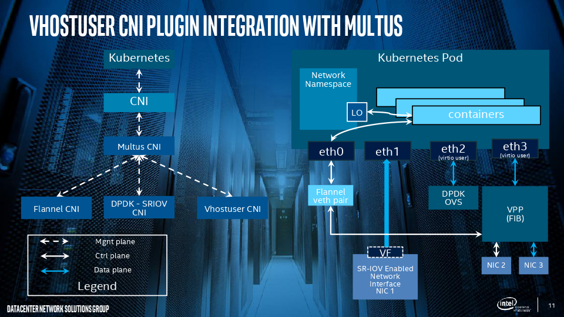

# Vhostuser CNI plugin

- Vhostuser plugin is a Container Network Interface (CNI) plugin to run with OVS-DPDK and VPP along with Multus CNI plugin in Kubernetes for Bare metal container deployment model. It enhances high performance container Networking solution and Dataplane Acceleration for NFV Environment.

- DPDK Vhostuser is new virtualization technology. Please refer to [here](http://dpdk.org/doc/guides/howto/virtio_user_for_container_networking.html) for more information.

<p align="center">
   
</p>

## Build & Clean

This plugin is recommended to build with Go 1.7.5 and VPP 17.01 which is fully tested. Other versions of Go and VPP are theoretically supported, but MIGHT cause unknown issue, please try to fix it by yourself / Welcome PR for latest VPP version.

```
#./build
```

Build the source codes to binary, copy the bin/vhostuser to the CNI folder for the tests.

```
#./clean
```

Remove the binary and temporary files generated whild building the source codes.

## Network configuration reference

* `name` (string, required): the name of the network
* `type` (string, required): "vhostuser"
* `vhost` (dictionary, required): Vhostuser configurations.
* `ipam` (dictionary, optional): IPAM configuration to be used for this network.

## Usage

### Work standalone

Given the following network configuration:

```
# cat > /etc/cni/net.d/99-vhostuser.conf <<EOF
{
	"type": "vhostuser",
	"name": "vhostuser-network",
	"if0name": "net0",
	"vhost": {
		"vhost_tool": "/path/to/vhost-user-net-plugin/tests/vpp-config.py"
	},
	"ipam": {
		"type": "host-local",
		"subnet": "10.56.217.0/24",
		"rangeStart": "10.56.217.131",
		"rangeEnd": "10.56.217.190",
		"routes": [
			{
				"dst": "0.0.0.0/0"
			}
		],
		"gateway": "10.56.217.1"
	}
}
EOF
```


### Integrated with Multus plugin for high performance container Networking solution for NFV Environment 

Refer Multus (NFV based Multi - Network plugin), DPDK-SRIOV CNI plugins
* [Multus - Multi Network plugin](https://github.com/Intel-Corp/multus-cni)
* [DPDK-SRIOV - Dataplane plugin](https://github.com/Intel-Corp/sriov-cni)

Encourage the users/developers to use Multus based Kubernetes CDR/TPR based network objects. Please follow the configuration details in the link: [Usage with Kubernetes CRD/TPR based Network Objects](https://github.com/Intel-Corp/multus-cni/blob/master/README.md#usage-with-kubernetes-crdtpr-based-network-objects)

Please refer the Kubernetes Network SIG - Multiple Network PoC proposal for more details refer the link - [K8s Multiple Network proposal](https://docs.google.com/document/d/1TW3P4c8auWwYy-w_5afIPDcGNLK3LZf0m14943eVfVg/edit)
<p align="center">
   
</p>

### Configuration details
```
# cat > /etc/cni/net.d/10-multus.conf <<EOF
{
    "name": "multus-demo-network",
    "type": "multus",
    "delegates": [
        {
                "type": "sriov",
                "if0": "ens786f1",
		"if0name": "net0",
		"dpdk": {
			"kernel_driver": "ixgbevf",
			"dpdk_driver": "igb_uio",
			"dpdk_tool": "/path/to/dpdk/tools/dpdk-devbind.py"
		}
        },
        {
		"type": "vhostuser",
    		"name": "vhostuser-network",
		"if0name": "net1",
		"vhost": {
			"vhost_tool": "/path/to/vhost-user-net-plugin/tests/vpp-config.py"
		},
		"ipam": {
			"type": "host-local",
			"subnet": "10.56.217.0/24",
			"rangeStart": "10.56.217.131",
			"rangeEnd": "10.56.217.190",
			"routes": [
				{
					"dst": "0.0.0.0/0"
				}
			],
			"gateway": "10.56.217.1"
		}
        },
        {
                "type": "flannel",
    		"name": "control-network",
                "masterplugin": true,
                "delegate": {
                        "isDefaultGateway": true
    		}
        }
    ]
}
EOF
```

Note: The Vhostuser CNI supports different IPAM plugins for the IP addresses management. The generated IP address information will be stored in one configuration file.

## Installing VPP or DPDK-OVS
Both VPP (Vector Packet Processing) and DPDK-OVS support VHOST_USER virtual ports. And it uses DPDK VIRTIO_USER as its client for the container network. Install VPP or DPDK-OVS for the Kubernetes node(s).

### Installing VPP
There are two ways to install the VPP packages. 
First of all, the VPP has pre-build packages for the main Linux distributions, please refer to the VPP’s [wiki page](https://wiki.fd.io/view/VPP/Installing_VPP_binaries_from_packages) for the details. Using Ubuntu 16.04 (Xenial) as an example to demonstrate how to install VPP from pre-build packages:
```
# export UBUNTU="xenial"
# export RELEASE=".stable.1701"
# sudo rm /etc/apt/sources.list.d/99fd.io.list
# echo "deb [trusted=yes] https://nexus.fd.io/content/repositories/fd.io$RELEASE.ubuntu.$UBUNTU.main/ ./" | sudo tee -a /etc/apt/sources.list.d/99fd.io.list
# sudo apt-get update
# sudo apt-get install vpp vpp-dpdk-dkms
```

The other way is to build the packages from source codes, for the detailed guides, please refer to the wiki page at [here](https://wiki.fd.io/view/VPP/Build,_install,_and_test_images). 
```
# git clone https://gerrit.fd.io/r/vpp
# cd vpp/build-root
# make distclean
# ./bootstrap.sh
# make V=0 PLATFORM=vpp TAG=vpp install-deb
# sudo dpkg install *.deb
```
### Installing DPDK-OVS
To install the DPDK-OVS, the source codes contains a [document](https://github.com/openvswitch/ovs/blob/master/Documentation/intro/install/dpdk.rst) for how to install the DPDK-OVS.

### Configuring the system
Both VPP and DPDK-OVS are DPDK based application, so there are some requirements, detailed system requirements can be found at [DPDK requirements](http://dpdk.org/doc/guides/linux_gsg/sys_reqs.html). Hugepages are the main requirement for the VHOST_USER virtual ports. 
```
# echo 'vm.nr_hugepages=2048' > /etc/sysctl.d/hugepages.conf
```
Or add the following configuration to the grub configuration:
```
# default_hugepagesz=2m hugepagesz=2m hugepages=2048
```
### Building DPDK Docker image and running a pod
* Before the vhostuser CNI installation, create the VPP 17.01 based Docker image, and use sample application since it provides ping tool to check basic network connectivity.
* Run 2 VPP 17.01 based pods in the same node. Highly recommend user to take care of it, please contact @kural or @abdul in [Intel-corp](https://intel-corp.herokuapp.com/) for more assistant on this. 
* With the deployment of 2 pod A and B, following vhostuser cni content with pause/infra/sandbox container ID is stored in /var/lib/cni/vhostuser

```
# tree /var/lib/cni/vhostuser
/var/lib/cni/vhostuser
├── 4d578250ad8d760c0722be78badb4b4b6d57fed8f95dea23aaa0065aa8657b29
│   ├── 4d578250ad8d-net1
│   ├── 4d578250ad8d-net1-ip4.conf
│   └── 4d578250ad8d-net1.json
├── 65bc360690b648458b7cbad34f8f274b6028973e82a284353d9c3ca63e1ad35e
│   ├── 65bc360690b6-net1
│   ├── 65bc360690b6-net1-ip4.conf
│   └── 65bc360690b6-net1.json
```

* Shows that there are two vhostuser ports, each for one container.
** xxxxxxxxxxxx-net1: The socket file for the Vhostuser server/client communication.
** xxxxxxxxxxxx-net1-ip4.conf: IPAM information for the Vhostuser port.
** xxxxxxxxxxxx-net1.json: Vhostuser Port information for the management.

```
# cat 4d578250ad8d-net1-ip4.conf
{
        "ipAddr": "10.56.217.132/32",
        "macAddr": "e2:52:b5:7b:58:ad",
        "gateway": "10.56.217.1",
        "gwMac": "02:fe:fc:89:49:d8"
}
```

* The IPAM management configuration for the port. 

```
# cat 4d578250ad8d-net1.json
{
    "vhostname": "VirtualEthernet0/0/0",
    "vhostmac": "02:fe:fc:89:49:d8",
    "ifname": "net1",
    "ifmac": "e2:52:b5:7b:58:ad",
    "vhost_tool": "/path/to/vhost-user-net-plugin/tests/vpp-config.py"
}
```

* Login the container A and run your own script to get the pause/infra/sandbox container ID (_here we used get-prefix.sh to get the container ID from our VPP docker image, highly recommend user to have their own docker image_)

```
$ /vhost-user-net-plugin/get-prefix.sh
4d578250ad8d760c0722be78badb4b4b6d57fed8f95dea23aaa0065aa8657b29
```

* Container A should use socket file/configuration file under the folder
/vhost-user-net-plugin/4d578250ad8d760c0722be78badb4b4b6d57fed8f95dea23aaa0065aa8657b29 .

* Run the VPP(version 17.01) in a container A as follows

```
# vpp unix {log /tmp/vpp.log cli-listen 0.0.0.0:5002} api-trace { on } \

  dpdk {coremask 0x2 no-multi-seg no-pci singlefile 512 extra --vdev=virtio_user0,path=/vhost-user-net-plugin/4d578250ad8d760c0722be78badb4b4b6d57fed8f95dea23aaa0065aa8657b29/4d578250ad8d-net1,mac=e2:52:b5:7b:58:ad } cpu {skip-cores 1}
# vppctl set int state virtio_user0 up
# vppctl set int ip table virtio_user0 0
```

* Run the VPP(version 17.01) in another container B and ping the Container A

```
# vppctl ping 10.56.217.132
```

* If the system works well, the ping would be successful

### Contacts
For any questions about Vhostuser CNI, please reach out on github issue or feel free to contact the developer @Kural and @abdul in our [Intel-Corp Slack](https://intel-corp.herokuapp.com/)
